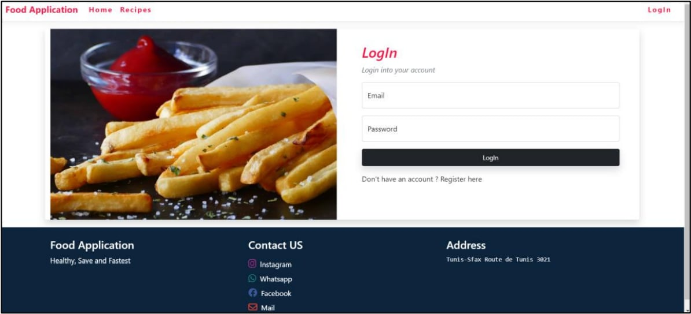
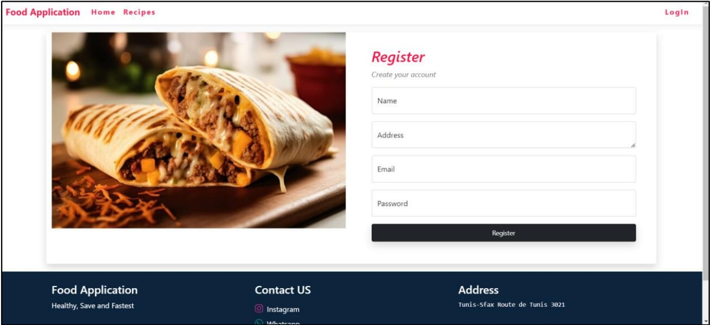
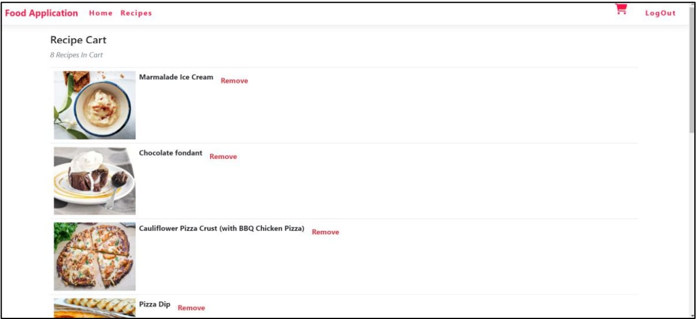
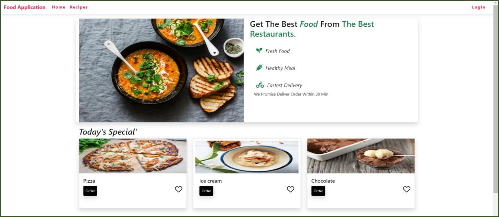
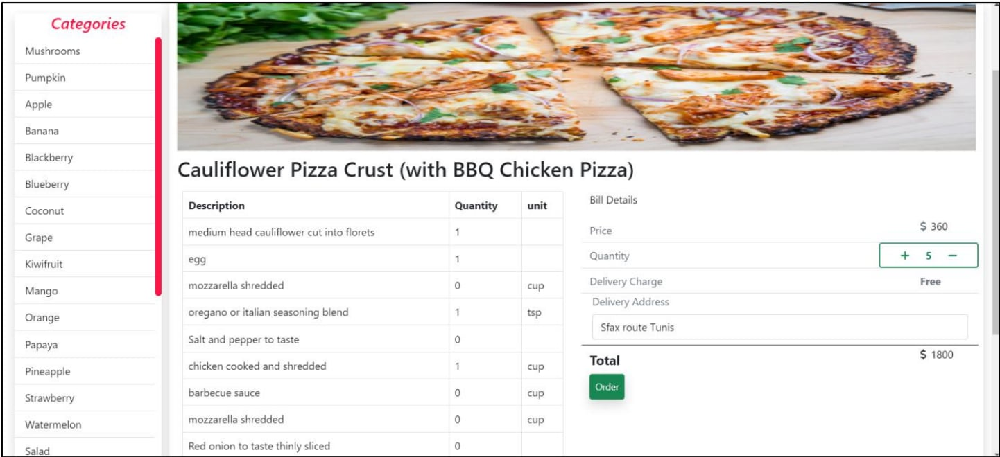
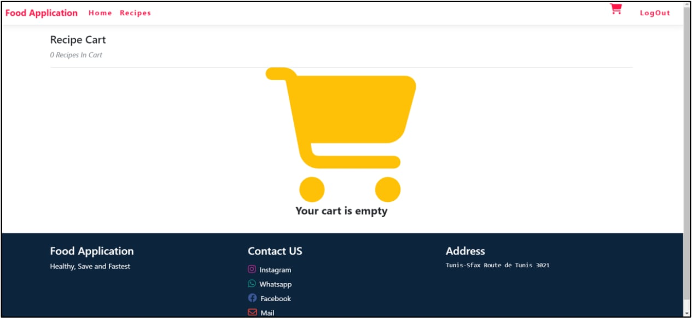

# Food and Recipes Application

Notre projet consiste en la conception et le développement d'une application alimentaire innovante visant à simplifier l'expérience des utilisateurs dans le domaine de la restauration.n
Développée avec **Visual Studio 2022** et reposant sur une base de données **SQL Server**, cette application utilise les langages **C#**, **HTML**, **CSS**, et **JavaScript**.n
Nous intégrons des **API** pour un accès aux données en temps réel, et utilisons **jQuery** et **Bootstrap 5** pour une interface intuitive et esthétique.n
L'intégration de **Font Awesome** enrichit visuellement l'application.n
L'objectif principal est de fournir une plate-forme conviviale où les utilisateurs peuvent explorer, commander, et interagir efficacement avec des établissements alimentaires.n
Grâce à des fonctionnalités back-end robustes en C# et une interface front-end réactive, notre application offre une expérience utilisateur fluide.

## 🖼️ Screenshots

  
  

